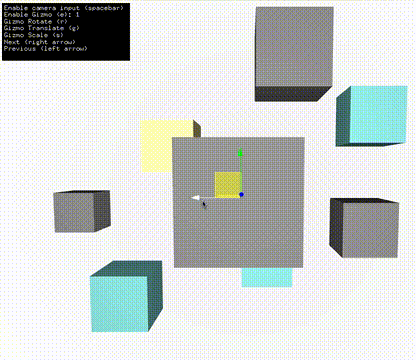

# ofxGizmo
An Openframeworks addon based on LibGizmo ( https://github.com/CedricGuillemet/LibGizmo )

Supports translate, scale and rotate gizmos.
Ability to load and save the transform.

Works with OF 0.10. For compatibility with older versions of OF, check the Releases.

